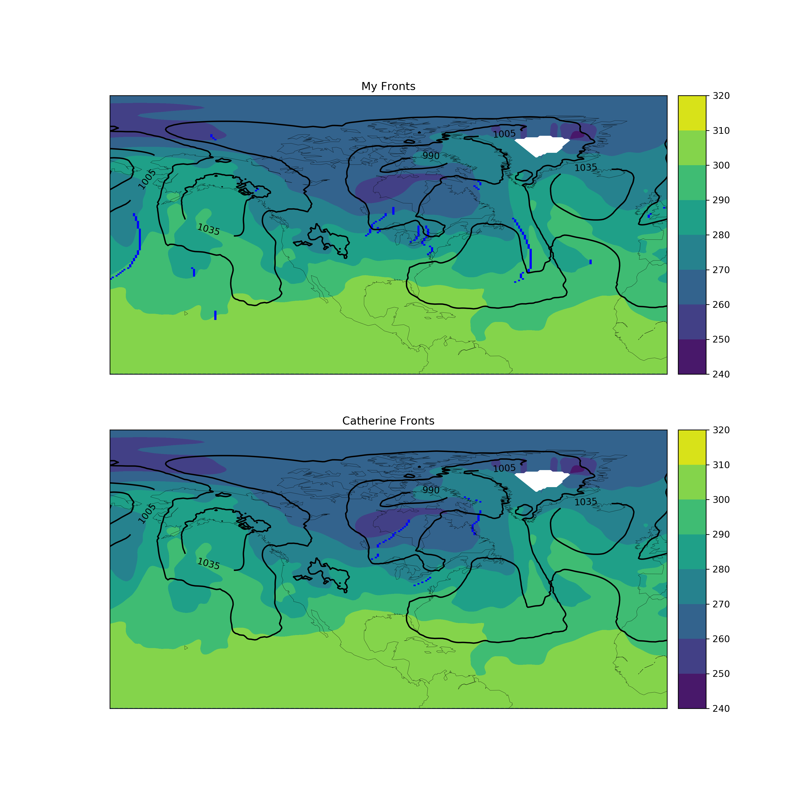

# front_detection
Code to detect cold and warm fronts given reanalysis data. 

python实现冷暖锋绘制。

merra2fronts数据集下载：https://portal.nccs.nasa.gov/datashare/Obs-ETC/Fronts-ETC/

merra2文件要素：https://gmao.gsfc.nasa.gov/pubs/docs/Bosilovich785.pdf

MERRA2fronts说明：https://portal.nccs.nasa.gov/datashare/Obs-ETC/Fronts-ETC/Readme_MERRA2fronts.pdf

MERRA2_400.inst6_3d_ana_Np.20170101.nc4文件下载地址：https://disc.gsfc.nasa.gov/datasets/M2I6NPANA_5.12.4/summary?keywords=%22MERRA-2%22

程序运行需要修改example.py里的MERRA2_400.inst6_3d_ana_Np.20170101.nc4文件路径，front_detection/catherine.py里的merra2fronts数据集路径。

